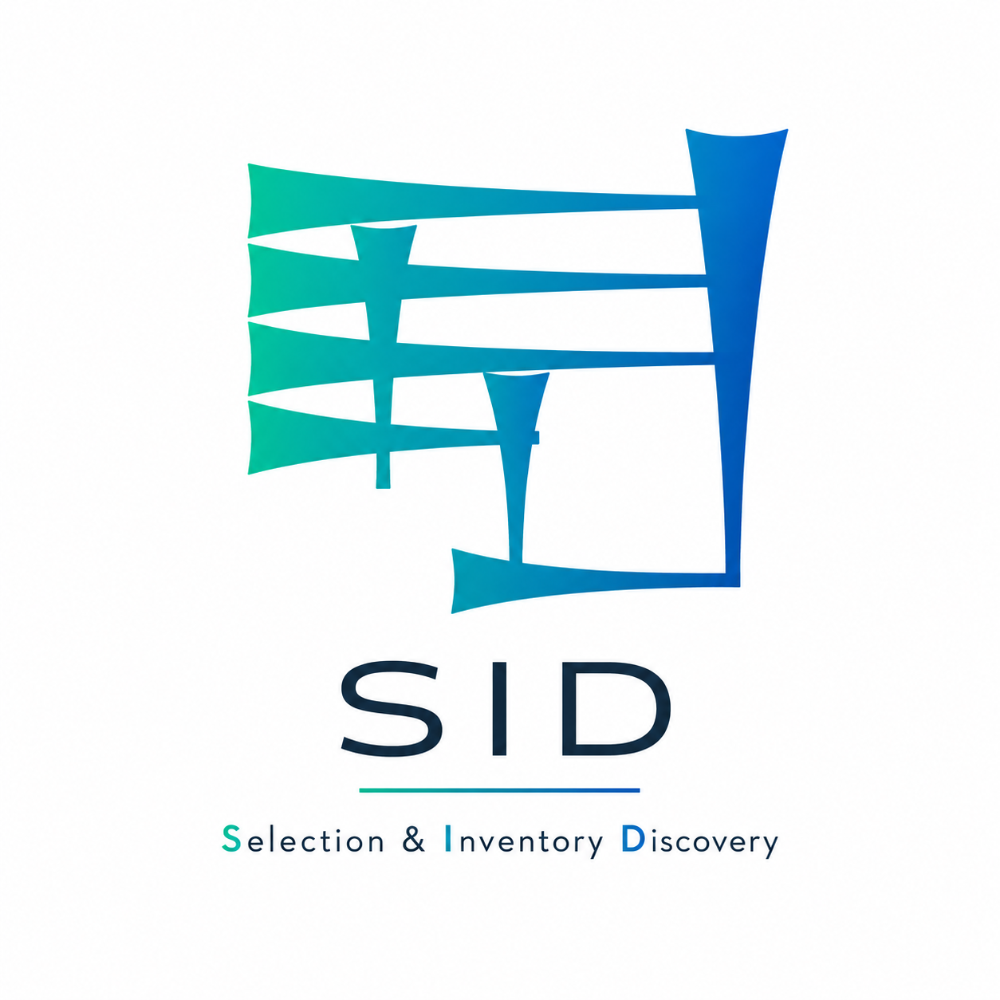

<div align="center">



<br>

**A catalogue-aware acquisition planning tool for libraries**

</div>

---

# SID

**SID — Selection & Inventory Discovery** is an acquisition-planning application
designed to help libraries evaluate bookseller and vendor offers against their
existing catalogue holdings.

SID aims to turn heterogeneous vendor lists into structured bibliographic data,
check potential acquisitions against configurable library catalogues, support
selection decisions and budget planning, and produce exportable order lists.

The project is currently in early MVP development.


## Goals

SID is being designed around a number of core principles:

- catalogue-independent architecture;
- Unicode and multiscript support from the beginning;
- preservation of original bibliographic data;
- transparent and reviewable catalogue matching;
- acquisition and budget planning;
- safe processing of untrusted vendor documents;
- optional use of local language models for difficult parsing tasks;
- extensibility to additional libraries, catalogues, vendors, and workflows.


## Planned Workflow

The intended acquisition workflow is:

```text
Order Plan
    │
    ▼
Order List
    │
    ▼
Vendor Document
    │
    ▼
Bibliographic Extraction
    │
    ▼
Normalization
    │
    ▼
Catalogue Lookup
    │
    ▼
Bibliographic Matching
    │
    ▼
Selection
    │
    ▼
Budget Management
    │
    ▼
Order List Export
```

Vendor documents may eventually include formats such as XLSX, CSV, and PDF.

The parsing architecture will be developed against representative real-world
vendor documents rather than assumptions about their structure.


## Acquisition Planning

SID organizes acquisition work into two primary planning levels.

### Order Plans

An order plan represents a higher-level acquisition project, for example:

```text
Myanmar Annual Order 2026
Budget: 900.00 EUR
```

### Order Lists

Each plan may contain multiple concrete order lists:

```text
Myanmar Annual Order 2026
├── Myanmar 2026-1
├── Myanmar 2026-2
└── Antiquarian Books 2026
```

Vendor documents will be associated with individual order lists.


## Catalogue Integration

SID is intentionally not tied to a particular library catalogue.

Catalogue systems are accessed through provider adapters:

```text
                    ┌── StabiKat
                    │
SID Catalogue ──────┼── SRU catalogue
                    │
                    ├── Union catalogue
                    │
                    └── Other providers
```

External catalogue records are normalized into an internal SID representation
before bibliographic matching takes place.

This separation is intended to allow other libraries to use SID with their own
catalogue infrastructure.


## Catalogue Matching

Catalogue lookup and catalogue matching are separate operations.

SID is intended to distinguish states such as:

```text
Exact edition found
Older edition found
Ambiguous match
Not found
Catalogue lookup failed
```

An older edition may therefore indicate that a work is already represented in the
collection without being treated as identical to the offered edition.

Catalogue failures are never interpreted as negative holdings results.


## Multilingual and Multiscript Support

SID is Unicode- and multiscript-native by design.

Bibliographic information must be preserved correctly regardless of writing system,
including scripts used across East, Southeast, South, and Central Asia and the
Middle East.

Original-script data remains authoritative source information.

Romanization, transliteration, and normalized representations are stored separately
where required and must never silently replace the original text.


## Language Models

Language models may eventually assist with ambiguous or poorly structured vendor
documents.

They are not intended to replace deterministic parsing where reliable structured
information is available.

A future parsing architecture may therefore use:

```text
Structured / deterministic parsing
              │
              ├── sufficient ──► validation
              │
              └── ambiguous
                     │
                     ▼
               OCR / local LLM
                     │
                     ▼
                  validation
```

Language-model output is treated as untrusted data and must pass explicit
validation before entering the SID domain.

The authoritative acquisition logic remains in the Elixir application.


## Technology

SID is built primarily with:

- Elixir
- Phoenix
- Phoenix LiveView
- Ecto
- PostgreSQL

Background processing is expected to use Oban.

Python may later be used behind an explicit service boundary for workloads where
its document-processing or machine-learning ecosystem provides a meaningful
advantage.


## Project Status

SID is currently under active early development.

The first MVP focuses on establishing:

- acquisition plans;
- order lists;
- budget management;
- the planning dashboard;
- catalogue-provider abstractions;
- bibliographic domain foundations;
- security and validation foundations.

Document parsing will be implemented after representative vendor files have been
examined.


## Architecture

The current architectural direction is documented in:

```text
docs/architecture.md
```

Engineering principles and development rules are documented in:

```text
ENGINEERING.md
```

Significant architectural decisions may be recorded as Architecture Decision
Records under:

```text
docs/decisions/
```


## Development

SID requires Elixir, Erlang/OTP, PostgreSQL, and the normal Phoenix development
toolchain.

Create a local environment file based on the example:

```bash
cp .env.example .env
```

Configure the local database values in `.env`.

Load the environment variables into the current shell:

```bash
set -a
source .env
set +a
```

Then prepare the application:

```bash
mix setup
```

Run the test suite with:

```bash
mix test
```

Start the Phoenix development server with:

```bash
mix phx.server
```

The application is then available by default at:

```text
http://localhost:4000
```


## Local Environment

Local secrets and development credentials must not be committed.

The repository contains:

```text
.env.example
```

as a safe template.

The local file:

```text
.env
```

must remain ignored by Git.

Example variables:

```bash
SID_DB_USER=sid
SID_DB_PASSWORD='CHANGE_ME'
SID_DB_HOST=localhost
SID_DB_NAME=sid_dev
SID_TEST_DB_NAME=sid_test
```


## Security

Vendor files and external API responses are considered untrusted input.

Security-sensitive functionality is expected to receive dedicated automated tests
throughout development.

Secrets must not be committed to the repository.

The project explicitly plans to test for relevant risks including:

- malicious or malformed file uploads;
- oversized files;
- decompression bombs;
- path traversal;
- spreadsheet formula injection;
- unsafe XML processing;
- SSRF;
- injection attacks;
- resource exhaustion;
- authorization bypasses;
- unsafe Unicode handling;
- malicious LLM output;
- prompt injection embedded in imported documents.

See `ENGINEERING.md` for the project's complete engineering and security rules.


## Extension Goals

The MVP is intentionally limited in scope, but the architecture is designed to allow
later extension without replacing the core application.

Planned extension paths include:

- additional catalogue providers;
- multiple catalogues;
- collaborative order planning;
- user accounts and authorization;
- repeated catalogue checks;
- acquisition follow-up;
- acquisition-system integrations;
- additional vendor formats;
- OCR;
- local language models;
- alternative parser implementations;
- additional exports;
- multiple currencies;
- additional multilingual and multiscript workflows.


## Contributing

SID is currently in an early development phase.

Contribution guidelines will be added once the initial architecture and MVP workflow
have stabilized.


## License

No license has been selected yet.
